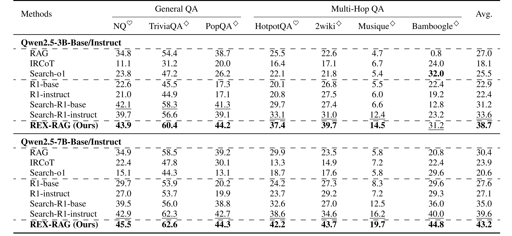
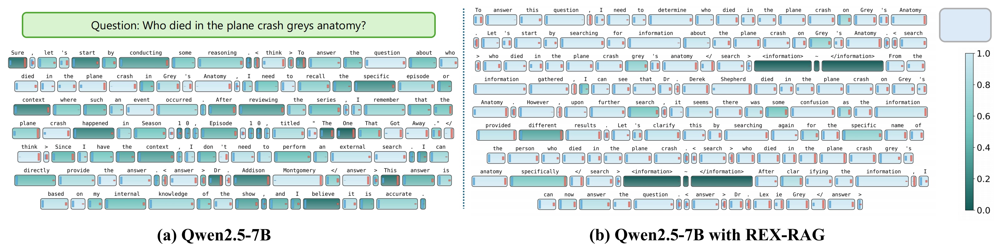

<p align="center">

  <h2 align="center"><strong>REX-RAG: Reasoning Exploration with Policy Correction in
Retrieval-Augmented Generation</strong></h2>

<div align="center">
<h5>
<em>Wentao Jiang<sup>1 *</sup>, Xiang Feng<sup>1 *</sup>, Zengmao Wang<sup>1 †</sup>, Yong Luo<sup>1</sup>, Pingbo Xu<sup>2,3</sup>, Zhe Chen<sup>4</sup>, Bo Du<sup>1</sup>, Jing Zhang<sup>1 †</sup> </em>
    <br><br>
       	<sup>1</sup> School of Computer Science, Wuhan University, China,<br/>
        <sup>2</sup> Department of Anesthesiology, Zhejiang Cancer Hospital, China,<br/> 
        <sup>3</sup> Institute of Medicine, Chinese Academy of Sciences, Hangzhou, Zhejiang, China<br/> 
        <sup>4</sup> Department of Computer Science and Information Technology, La Trobe University, Australia<br/> 
</h5>
<h5>
<sup>∗</sup> Equal contribution, <sup>†</sup> Corresponding author
</h5>
</div>

# 🔥 Update
**2025.08.11**
- We released the code on Github!!!

# 🌞 Introduction

REX-RAG is a reinforcement learning framework for Retrieval-Augmented Generation that escapes reasoning dead ends through a mixed sampling strategy and maintains stable policy learning via a principled policy correction mechanism. It delivers significant performance boosts on multi-hop reasoning and general QA tasks, with strong out-of-domain generalization and compatibility with various RL training algorithms.

<figure>
<div align="center">

</div>
<div align="center">
<figcaption align = "center"><b>Figure 1: Overview of the REX-RAG. 
 </b></figcaption>
</div>
</figure>

# 🛠️ Usage

> **Note:** Please ensure that you have configured the paths within the bash scripts to match your local environment.

### 1. Installation

First, install the required dependencies. We recommend using `uv` for faster installation.

```bash
# Upgrade pip and install uv
pip install --upgrade pip
pip install uv

# Install sglang (version 0.4.6.post4 is required)
uv pip install "sglang[all]==0.4.6.post4"

# Install PyTorch (replace cu12x with your CUDA version, e.g., cu126)
pip install torch==2.6.0 torchvision==0.21.0 torchaudio==2.6.0 --index-url https://download.pytorch.org/whl/cu1xx

# Install flash-attn
pip3 install flash-attn --no-build-isolation

# Install other dependencies
pip install wandb

# Install the project in editable mode
pip install -e .
```
For more details on `sglang` installation, please refer to the [official documentation](https://docs.sglang.ai/get_started/install.html).

### 2. Data Preparation

#### Retriever
The retriever requires a Wikipedia corpus. You can either process it manually or download a pre-processed version.

- **Option A: Process Wikipedia manually.**
  Follow the instructions at [FlashRAG Wiki Processing](https://github.com/RUC-NLPIR/FlashRAG/blob/main/docs/original_docs/process-wiki.md).

- **Option B: Download pre-processed data.**
  Download the data from [Hugging Face Datasets](https://huggingface.co/datasets/RUC-NLPIR/FlashRAG_datasets/tree/main/retrieval-corpus).

After obtaining the data, build the search index:
```bash
bash scripts/search_engine/build_index.sh
```

#### Datasets
You can fetch the required datasets using `git lfs`.
```bash
git lfs pull
```
Alternatively, you can use your own custom dataset. Please refer to the preprocessing methods described in [Search-R1](https://github.com/PeterGriffinJin/Search-R1/tree/main?tab=readme-ov-file#use-your-own-dataset).

### 3. Running the Application

First, start the retriever server:
```bash
bash scripts/search_engine/retrieval_server.sh
```
Then, you can proceed to run the main application. 
```bash
bash scripts/search-r1-sgl/run_grpo_sglang_fsdp.sh
```

# 📖 Main Results

<figure>
<div align="center">

</div>
<div align="center">
<figcaption align = "center"><b>Figure 2: Main experimental results on seven QA benchmarks of REX-RAG.
 </b></figcaption>
</div>
</figure>

# 🔍 Visualization

<figure>
<div align="center">

</div>
<div align="center">
<figcaption align = "center"><b>Figure 3: Uncertainty quantification visualization comparing Qwen2.5-7B and Qwen2.5-7B with REX-RAG.
 </b></figcaption>
</div>
</figure>

Figure 3 presents a visualization analysis comparing the reasoning trajectories of the original Qwen2.5-7B model against the same model enhanced with REX-RAG. This analysis uses the uncertainty quantification method from **LogTokU** ([GitHub](https://github.com/MaHuanAAA/logtoku)).

Following their framework, we analyze two types of uncertainty:
- **Aleatoric Uncertainty (AU):** Represents inherent data randomness.
- **Epistemic Uncertainty (EU):** Captures gaps in the model's knowledge.

These are measured through token-level confidence scoring. The visualization demonstrates that REX-RAG achieves significantly higher reliability scores for its reasoning tokens (typically in the 0.6-0.8 range), whereas the baseline model exhibits lower reliability (generally in the 0.2-0.4 range).

# Acknowledgements

We would like to express our gratitude to the following open-source projects that were instrumental in our work:
- [**verl**](https://github.com/volcengine/verl)
- [**Search-R1**](https://github.com/PeterGriffinJin/Search-R1)
- [**FlashRAG**](https://github.com/RUC-NLPIR/FlashRAG)

Special thanks to [**LogTokU**](https://github.com/MaHuanAAA/logtoku) for their excellent work on uncertainty visualization, which we adapted for our analysis.

# ⭐ Citation

If you find our work useful, please consider giving a ⭐ and citing our paper:
```
@article{jiang2025rex,
  title={REX-RAG: Reasoning Exploration with Policy Correction in Retrieval-Augmented Generation},
  author={Jiang, Wentao and Feng, Xiang and Wang, Zengmao and Luo, Yong and Xu, Pingbo and Chen, Zhe and Du, Bo and Zhang, Jing},
  journal={arXiv preprint arXiv:2508.08149},
  year={2025}
}
```